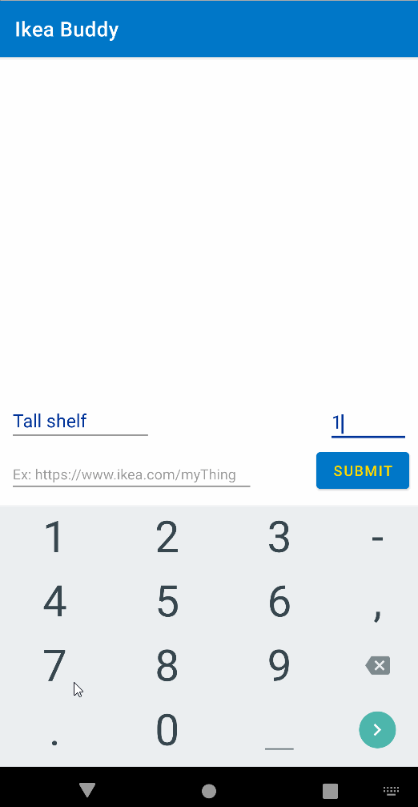

# Android Project 2 - IkeaBuddy

Submitted by: Megan Steele

IkeaBuddy is a wishlist app that helps the user keep track of what they want to buy.

Time spent: 6 hours spent in total

## Required Features

The following **required** functionality is completed:

- [X] **User can add an item to their wishlist**
- [X] **User can see their list of items based on previously inputted items**

The following **optional** features are implemented:

- [X] Wishlist app is 🎨 **customized** 🎨
- [X] User can delete an item by long pressing on the item
- [X] User can open an item's URL by clicking on the item

The following **additional** features are implemented:

* [X] Basic input validation. Name must be provided, price defaults to zero if not provided, and url may be empty.

## Video Walkthrough

Here's a walkthrough of implemented user stories:

GIF created with [LiceCap](http://www.cockos.com/licecap/)

## Notes

Challenging to implement item storage with no database!
Long press handling was tricky

## License

    Copyright 2022 Megan Steele

    Licensed under the Apache License, Version 2.0 (the "License");
    you may not use this file except in compliance with the License.
    You may obtain a copy of the License at

        http://www.apache.org/licenses/LICENSE-2.0

    Unless required by applicable law or agreed to in writing, software
    distributed under the License is distributed on an "AS IS" BASIS,
    WITHOUT WARRANTIES OR CONDITIONS OF ANY KIND, either express or implied.
    See the License for the specific language governing permissions and
    limitations under the License.